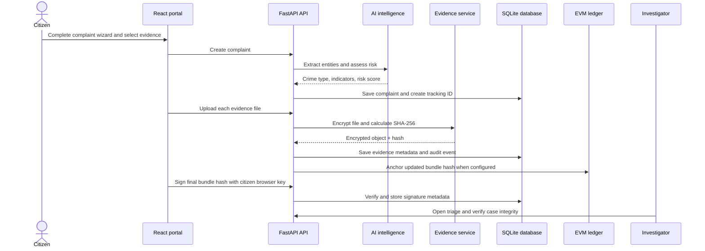

# Research Notes — CyberShield Ledger

## 1. Project title

**CyberShield Ledger: An AI-Assisted, Privacy-Preserving Cybercrime Reporting and Digital Evidence Integrity Platform**

## 2. One-paragraph project summary

CyberShield Ledger is a web-based prototype for reporting, triaging, investigating, and governing cybercrime complaints. It combines a citizen-facing complaint wizard, investigator and administrator workspaces, encrypted evidence handling, AI-assisted entity extraction, local threat-intelligence analysis, and an optional blockchain chain-of-custody layer. The central design choice is that sensitive material—such as complaint narratives, identity details, and uploaded files—remains off-chain. Only a cryptographic hash representing the evidence bundle is intended to be anchored to an EVM-compatible blockchain. This lets the system demonstrate evidence-integrity verification without exposing private case data on a public ledger.

## 3. Research problem

Cybercrime reporting is often delayed, incomplete, and difficult to analyze at scale. Victims may submit unstructured narratives and screenshots with inconsistent details, while investigators must manually identify repeated phone numbers, UPI IDs, email addresses, URLs, wallet addresses, and related cases. Evidence can also be challenged if there is no clear record of its handling or proof that it has not changed after submission.

The research problem can be stated as:

> How can a cybercrime reporting platform improve early triage, evidence integrity, privacy, and cross-case intelligence while keeping sensitive victim data out of a blockchain ledger?

## 4. Aim and objectives

### Aim

To design and implement a prototype cybercrime-response platform that combines AI-assisted complaint intelligence, encrypted evidence handling, role-based investigation workflows, and blockchain-backed integrity verification.

### Objectives

1. Provide an accessible reporting workflow for citizens.
2. Capture structured and unstructured complaint information.
3. Extract investigation-relevant indicators from narrative text.
4. Calculate explainable risk, duplicate, and campaign signals.
5. Encrypt uploaded evidence with AES-256-GCM.
6. Calculate SHA-256 evidence hashes and a complaint bundle hash.
7. Support citizen-held digital signatures for complaint-bundle authenticity.
8. Anchor only non-sensitive bundle hashes to an EVM smart contract.
9. Provide investigator triage, threat intelligence, and chain-of-custody views.
10. Provide administrative oversight, approvals, audit logs, and governance metrics.

## 5. Users and role model

| User | Main responsibilities | Security boundary |
| --- | --- | --- |
| Citizen | Register/login, report a cybercrime, upload evidence, track cases, check scam indicators, read safety guidance | Can access only their own complaint history and evidence. |
| Investigator | Review and prioritize cases, inspect indicators, verify evidence integrity, add investigation notes, prepare drafts | Uses authenticated investigator workflows and audit-visible actions. |
| Administrator | Approve investigators, manage roles and agencies, monitor platform health, audit activities, and governance | Performs system-level oversight and access-management actions. |

## 6. End-to-end workflow



## 7. Technical architecture

| Layer | Technology | Research role |
| --- | --- | --- |
| Frontend | React, TypeScript, Vite, Tailwind CSS | Provides citizen, investigator, administrator, and login interfaces. |
| Backend | Python, FastAPI, Pydantic, SQLAlchemy | Implements APIs, validation, workflow orchestration, authorization, and audit events. |
| Database | SQLite for the prototype | Stores complaint, user, evidence metadata, digital signature, audit, agency-request, and note records. |
| Evidence security | Cryptography library, AES-256-GCM, SHA-256 | Protects evidence confidentiality and detects integrity changes. |
| Authentication | bcrypt, JWT | Protects user credentials and provides time-limited authenticated sessions. |
| AI intelligence | Gemini-backed extraction plus local rules | Extracts case details and supports risk, duplicate, and campaign signals. |
| Blockchain | Solidity, Web3.py, Hardhat scaffold | Anchors the non-sensitive complaint bundle hash on Polygon Amoy/Ethereum-compatible networks. |

## 8. Data collected for a complaint

The complaint wizard captures title, detailed narrative, incident date and location, fraud category, transaction amount, suspect phone number, UPI ID, bank account, wallet address, website URL, suspect email, and evidence files. The system can derive additional fields such as crime type, bank name, payment method, urgency, risk score, suggested agency, and linked-case signals.

These indicators are useful because many fraud campaigns reuse payment handles, telephone numbers, wallet addresses, URLs, or social-engineering language. Their repeated occurrence can support early campaign detection, but a match is an investigative lead—not proof of guilt.

## 9. Evidence-integrity design

### 9.1 Confidentiality

Each uploaded file is encrypted using AES-256-GCM before storage. AES-GCM provides encryption and authenticated decryption. The encryption key is derived from the protected `EVIDENCE_ENCRYPTION_KEY` configuration value; it must never be committed to source control.

### 9.2 Integrity

For each original file, the system records a SHA-256 digest. It then calculates a deterministic case-bundle hash:

```text
bundle_hash = SHA-256(
  complaint_id : complaint_description : created_at : sorted(evidence_hashes)
)
```

If protected complaint content or the evidence-hash set changes, the recomputed bundle hash differs. This provides a detectable integrity signal.

### 9.3 Authenticity

The browser generates an RSA-PSS key pair and signs the final bundle hash. The private key stays in browser storage; the backend receives the public key, signature, algorithm label, and signed hash. The API verifies the signature before recording it. A production implementation would require stronger identity binding, hardware-backed keys or a managed signing service, recovery policies, and certificate governance.

### 9.4 Chain of custody

Audit events record important actions such as complaint creation, AI processing, evidence addition, evidence viewing, user login, status changes, and access grants. The optional ledger anchor supplements—not replaces—the operational audit log.

## 10. Blockchain design

The Solidity contract stores the following non-sensitive values:

- Complaint ID
- Evidence bundle hash
- Blockchain timestamp
- Agency label
- Case status
- Existence flag
- Investigator authority access grants

Raw evidence, victim identity, narratives, phone numbers, UPI IDs, emails, and other personal data are not written to the chain. This avoids an irreversible disclosure of sensitive data and keeps blockchain transaction costs low.

The target test network is Polygon Amoy (`chainId: 80002`), with a Hardhat deployment script and Web3.py adapter. The blockchain integration is optional: when RPC, contract address, or a dedicated wallet key are not configured, the local encrypted evidence and SHA-256 verification flow remains available.

## 11. AI and intelligence notes

### Implemented intelligence

- Gemini-assisted structured extraction when `GEMINI_API_KEY` is configured.
- Local extraction of phone numbers, UPI IDs, emails, URLs, wallets, IP addresses, and bank-account values.
- Heuristic risk score fallback based on transaction value, fraud category, and available indicators.
- Duplicate signals from shared indicators, approximate transaction values, shared crime type, and narrative similarity.
- Campaign signal when meaningful linked-case indicators are detected.

### Planned research extensions

The repository includes well-defined extension points for spaCy entity pipelines, Hugging Face or Llama inference, Sentence Transformers embeddings, FAISS vector search, OCR, speech-to-text, summarization, chatbot assistance, and campaign clustering. These are not yet a validated trained-model pipeline. In the paper, describe them as future work unless experimental results are produced.

## 12. Evaluation methodology

The prototype can be evaluated with controlled test cases rather than real victim data.

| Test case | Metric or observation |
| --- | --- |
| Submit a UPI-fraud complaint with a receipt | Complaint creation time, tracking-ID generation, encryption success, hash creation. |
| Submit a second complaint with the same UPI ID | Duplicate/campaign signal precision. |
| Submit a phishing complaint with a URL | Entity-extraction completeness and correct crime classification. |
| Modify a test evidence record or controlled metadata input | Integrity verification should report a mismatch. |
| Submit a citizen signature | Backend must accept a valid signature and reject a mismatched bundle hash. |
| Register an investigator | Account should be pending until administrator approval. |
| Inspect administrator governance dashboard | Verify audit visibility, evidence count, and operational statistics. |

Suggested quantitative measures:

- **Entity extraction precision/recall:** correct indicators extracted divided by extracted/expected indicators.
- **Duplicate-detection precision:** true linked cases divided by all cases marked linked.
- **Duplicate-detection recall:** linked cases found divided by all known linked cases.
- **Triage time:** elapsed time from submission to investigator-ready classification.
- **Integrity detection rate:** percentage of controlled modifications identified by recomputation.
- **Usability score:** System Usability Scale (SUS) or a structured feedback questionnaire.

## 13. Research contribution

The main contribution is the integration of five functions normally treated separately: citizen intake, AI-assisted triage, encrypted evidence storage, cross-case threat intelligence, and blockchain-verifiable integrity. The architecture avoids treating blockchain as a database for sensitive reports. Instead, it uses blockchain narrowly as a tamper-evident commitment layer while operational data remains in protected storage.

## 14. Limitations to state clearly

- The project is a prototype, not a production law-enforcement system.
- SQLite and local encrypted storage are appropriate for a demonstration, not high-availability operations.
- AI extraction relies on a configured third-party model and has not been evaluated with a labelled cybercrime dataset.
- The screenshot scan is a user-interface demonstration; forensic OCR is not currently implemented.
- Voice input uses browser speech recognition and depends on browser support.
- Anonymous reporting masks displayed identity but is not a full zero-knowledge proof implementation.
- Blockchain anchoring requires a deployed contract, RPC endpoint, test wallet, transaction fees, monitoring, and a smart-contract audit.
- Duplicate/campaign signals are leads for human review and must not be presented as proof of criminal attribution.
- Legal drafts and agency requests are internal review aids; they are not official external submissions.

## 15. Future scope

1. Replace local SQLite with PostgreSQL and migrations.
2. Use MinIO/IPFS-compatible storage with envelope encryption and managed keys.
3. Add malware scanning, MIME validation, retention controls, and legal-hold policies.
4. Integrate OCR and speech-to-text with confidence scores and human verification.
5. Build a labelled dataset to evaluate extraction, risk, duplicate, and campaign models.
6. Add Sentence Transformers and FAISS for semantic similarity across complaint narratives.
7. Integrate verified external threat feeds and authorized bank/telecom workflows.
8. Implement a reviewed Circom/SnarkJS zero-knowledge proof flow for anonymous eligibility proofs.
9. Add MFA, rate limiting, field-level permissions, immutable audit exports, and key rotation.
10. Conduct a formal Solidity security audit before any non-testnet deployment.

## 16. Suggested paper chapter structure

1. Abstract
2. Introduction
3. Literature Review
4. Problem Statement and Objectives
5. Proposed System and Architecture
6. Methodology and Implementation
7. Security, Privacy, and Blockchain Design
8. Experimental Setup and Evaluation
9. Results and Discussion
10. Limitations and Future Work
11. Conclusion
12. References

## 17. Suggested keywords

Cybercrime reporting; digital forensics; evidence integrity; blockchain; AI-assisted triage; threat intelligence; AES-256-GCM; SHA-256; JWT; role-based access control; complaint duplicate detection; Polygon Amoy.
