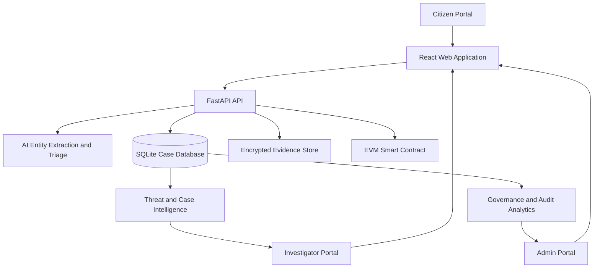
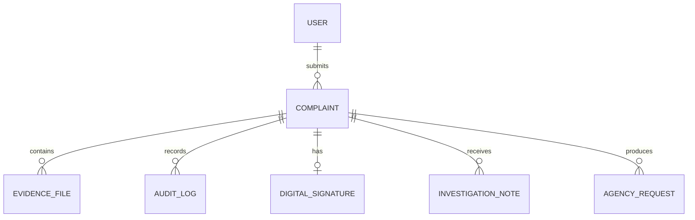

# CyberShield Ledger: A Decentralized, AI-Assisted Cybercrime Intake and Triage Platform

**Project type:** Applied cybersecurity and digital-forensics prototype  
**Technology stack:** React, TypeScript, FastAPI, SQLite, AES-256-GCM, SHA-256, RSA-PSS, EVM/Solidity

## Abstract

Cybercrime reporting systems often suffer from incomplete reports, delayed triage, duplicate complaints, weak evidence handling, and limited visibility into coordinated fraud campaigns. CyberShield Ledger is an applied prototype that addresses these challenges through a citizen reporting portal, AI-assisted intake, encrypted evidence storage, cryptographic integrity controls, an optional blockchain proof layer, and investigator and administrator workspaces. Citizens submit incidents through a structured five-step workflow, including transaction and suspect indicators such as phone numbers, UPI IDs, URLs, wallet addresses, and emails. The backend analyzes the report, assesses risk, searches for duplicate signals, stores encrypted evidence, and produces a unique tracking ID. Investigators receive case intelligence such as linked complaints, campaign signals, priority, recovery recommendations, timelines, and suggested playbooks. Administrators monitor platform health, audit activity, evidence storage, user approval, analytics, backups, and governance controls.

The prototype adopts a privacy-preserving design: complaint narrative and evidence remain off-chain, while only a cryptographic bundle hash and selected non-sensitive case metadata are intended for an EVM-compatible ledger. This paper documents the architecture, implementation analysis, security model, limitations, and future research directions of the system.

**Keywords:** cybercrime reporting, digital evidence, AI triage, blockchain, threat intelligence, AES-256-GCM, SHA-256, investigation support

## 1. Introduction

The first hours after a cybercrime incident are critical. Victims may need to report a fraudulent payment before funds are dispersed, preserve screenshots before messages disappear, and communicate suspect information that can be linked to reports from other victims. In traditional reporting workflows, information is often manually reviewed, duplicate reports are difficult to associate, and evidence handling can lack a transparent, verifiable record.

CyberShield Ledger is designed as a hackathon-scale response to this problem. Rather than treating each complaint as an isolated form submission, it treats a complaint as the beginning of a secure, data-driven investigation workflow. The system combines three goals:

1. Make reporting accessible and structured for citizens.
2. Help investigators prioritize and connect cases faster.
3. Preserve confidentiality, integrity, authenticity, and auditability of evidence.

## 2. Problem Statement

The project addresses the following operational gaps:

- Victims may submit unstructured, incomplete descriptions that delay classification and routing.
- Repeated reports against the same UPI ID, phone number, website, or wallet may not be linked early enough to reveal an active campaign.
- Evidence can be altered or mishandled if it is not encrypted and logged with integrity controls.
- Investigators need a concise case view rather than manually reconstructing the scam sequence from multiple records.
- Administrators need a single governance view for approvals, security activity, system health, evidence storage, and compliance.

## 3. Objectives

The primary objectives of CyberShield Ledger are:

- provide a secure citizen complaint intake workflow;
- extract investigation-relevant entities from the complaint narrative;
- calculate risk and duplicate/campaign signals;
- protect uploaded evidence through AES-256-GCM encryption;
- create SHA-256-based evidence and complaint bundle integrity proofs;
- support optional anchoring of the bundle hash to an EVM smart contract;
- provide investigator intelligence, playbooks, and chain-of-custody data;
- provide role-based administrative governance and audit controls.

## 4. System Architecture

The frontend uses React and TypeScript, with role-protected routes for citizen, investigator, and administrator users. FastAPI implements the API and orchestrates complaint creation, evidence handling, AI processing, access checks, and reporting. SQLite is used as the local prototype database. The architecture is deliberately modular so that SQLite and local file storage can later be replaced by managed database and object-storage services.

## 5. Functional Modules

### 5.1 Citizen Module

The citizen module provides a five-step complaint wizard:

1. Personal information, date, and location of incident.
2. Fraud category selection.
3. Transaction and suspect details.
4. Incident narrative and evidence upload.
5. Review and secure submission.

The workflow supports voice-to-text reporting through the browser speech-recognition capability and includes a clearly labeled demo screenshot-scan function. The scan function currently populates sample transaction data; it is not represented as production OCR. A citizen can optionally select anonymous demo mode, which masks the citizen name in case-facing information while retaining the authenticated account link needed to view the case history securely.

After submission, the backend creates a tracking identifier in the form `CS-XXXXXXXX`, stores the report, runs AI analysis when configured, computes duplicate signals, and places the case into the investigator workflow. Citizens can view dashboard counts, recent complaints, searchable history, status timelines, evidence metadata, and integrity results.

### 5.2 Investigator Module

The investigator workspace provides case triage, evidence verification, a threat graph, and a dedicated case-intelligence page. Intelligence is locally derived from complaint fields and narrative content. It identifies indicators including phone numbers, UPI IDs, emails, URLs, wallet addresses, IP addresses, and bank accounts. Cases with shared indicators or sufficiently similar narratives are surfaced as potential links.

The system generates the following decision-support outputs:

- investigation priority and explainable reasons;
- linked cases and campaign signals;
- recovery-probability estimate based on report age, amount, and payment indicators;
- suggested bank-freeze or preservation actions;
- scam timeline reconstruction from report and audit events;
- crime-type-specific investigation playbooks;
- similar resolved-case matches;
- suspect profile summary;
- local threat-intelligence prevalence;
- evidence summaries and a chain-of-custody view;
- collaboration notes and assignee fields.

These outputs are decision aids, not automated legal or investigative conclusions.

### 5.3 Admin Module

The administrator controls user approval, system governance, analytics, evidence monitoring, and operational oversight. The governance dashboard reports users by role, pending investigator approvals, complaint volume, active investigations, high-risk cases, resolution rate, average loss, evidence counts, encrypted storage size, audit logs, and platform configuration state.

The operations workspace adds investigator performance data, locally saved agency communication drafts, and review drafts for a bank-freeze request, FIR summary, and evidence-preservation report. Exports and local SQLite backups are available to the administrator. External delivery to banks, telecom operators, payment gateways, exchanges, and CERT-In is intentionally not implemented; the system saves a draft and labels it accordingly.

## 6. Security and Privacy Analysis

### 6.1 Authentication and authorization

Passwords are processed with bcrypt, and approved users receive time-limited JWTs. JWT is a compact claims format standardized by RFC 7519. The application enforces roles both in FastAPI endpoints and React route guards. Citizen accounts are restricted to their own reports; investigators and administrators have broader operational access.

### 6.2 Evidence confidentiality

Evidence files are encrypted before local storage using AES-256-GCM. AES is a NIST standard block cipher with AES-128, AES-192, and AES-256 key variants; the project derives a 256-bit key from a configured server secret. AES-GCM also authenticates encrypted content, helping detect unauthorized modification during decryption. [NIST FIPS 197](https://csrc.nist.gov/pubs/fips/197/final)

### 6.3 Integrity and authenticity

The application computes SHA-256 hashes for original evidence files and a complaint bundle hash built from complaint data, timestamp, and evidence hashes. NIST describes secure-hash digests as a mechanism for detecting changes to data after a digest is generated. [NIST FIPS 180-4](https://csrc.nist.gov/pubs/fips/180-4/upd1/final)

The citizen portal can generate an RSA-PSS signing keypair in the browser and submit the public key and signature metadata for the complaint hash. This helps demonstrate non-repudiation and authorship claims, although a production deployment would require stronger key-management, identity verification, recovery, and certificate policies.

### 6.4 Blockchain proof layer

The Solidity contract stores a complaint ID, evidence bundle hash, timestamp, agency, case status, and access grants. It explicitly does not store personal narrative or raw evidence. This reflects the core privacy principle of keeping sensitive content off-chain while using the ledger as a tamper-evident proof mechanism. Ethereum smart contracts are programs with code and state at a blockchain address; writes are transactions and reads do not change state. [Ethereum smart-contract documentation](https://ethereum.org/developers/docs/smart-contracts/), [contract interaction documentation](https://ethereum.org/developers/docs/smart-contracts/interacting/)

## 7. Data Model and Evidence Lifecycle

Key entities are `User`, `Complaint`, `EvidenceFile`, `AuditLog`, `DigitalSignature`, `CaseAccessGrant`, `InvestigationNote`, and `AgencyRequest`.

The evidence lifecycle is: upload → size validation → AES-GCM encryption → encrypted-file storage → original-file SHA-256 capture → metadata persistence → bundle-hash refresh → audit-log entry → optional ledger update. Download requests decrypt evidence only after role and case-access verification and create an audit event.

## 8. Evaluation Approach

This prototype is evaluated primarily through functional and architectural verification rather than a human-subject or field study. The following demonstration scenarios are suitable for a hackathon evaluation:

| Scenario | Expected outcome |
| --- | --- |
| Submit a UPI-fraud report with a receipt | A tracking ID, AI triage, encrypted evidence record, hash, and investigator case are created. |
| Submit a second report with the same UPI or phone | Duplicate score and linked-case/campaign signals appear. |
| Open case intelligence | Priority, recovery guidance, linked cases, playbook, and next actions appear. |
| Change an evidence-associated data value in a controlled test | Recomputed integrity hash differs from the stored proof. |
| Create an investigator account | Account remains pending until administrator approval. |
| Add a collaboration note or agency draft | The action is stored and reflected in audit/governance views. |

Frontend production compilation and Python syntax checks have been completed during development. Full live validation requires configured FastAPI dependencies, secrets, an optional AI API key, and optional blockchain credentials.

## 9. Limitations

CyberShield Ledger is a prototype and has important limitations:

- AI extraction depends on a configured Gemini API key; without it, the fallback response is limited.
- OCR screenshot scanning is a frontend demo, not forensic OCR.
- Threat intelligence is computed from local complaints, not live commercial or government threat feeds.
- Fraud scoring, recovery probability, and case priority are explainable heuristics, not validated predictive models.
- SQLite and local encrypted file storage are appropriate for a demo, not multi-region production operations.
- The EVM integration requires deployment, RPC configuration, key protection, gas management, contract audit, and monitoring before use in production.
- Agency communications and legal drafts are review aids; they do not replace official workflows, legal review, or authorized transmission channels.
- Anonymous mode is a privacy demonstration and is not a zero-knowledge identity system.

## 10. Future Work

Future work should prioritize real OCR, malware scanning, auditable external threat feeds, secure bank/1930 and telecom integrations, geographic analysis, investigator workload balancing, fine-grained permission enforcement, managed secrets, object storage, database backup/restore controls, and formal smart-contract security review. A rigorous research extension could evaluate extraction accuracy, duplicate-detection precision/recall, time-to-triage reduction, usability for victims, and false-positive risk in campaign detection.

## 11. Conclusion

CyberShield Ledger demonstrates how citizen reporting, evidence security, AI-assisted triage, threat intelligence, blockchain integrity proof, and administrative governance can be integrated into one cybercrime-response workflow. Its strongest contribution is the connection between secure intake and actionable investigation: a report becomes a tracked case with protected evidence, linked indicators, auditable actions, and prioritized investigative guidance. The system is suitable as a hackathon demonstration and a foundation for deeper research, provided its AI, legal, privacy, external-integration, and operational limitations are addressed before real-world deployment.

## References

1. National Institute of Standards and Technology. *FIPS 197: Advanced Encryption Standard (AES).* 2023 update. [https://csrc.nist.gov/pubs/fips/197/final](https://csrc.nist.gov/pubs/fips/197/final)
2. National Institute of Standards and Technology. *FIPS 180-4: Secure Hash Standard (SHS).* [https://csrc.nist.gov/pubs/fips/180-4/upd1/final](https://csrc.nist.gov/pubs/fips/180-4/upd1/final)
3. Jones, M., Bradley, J., and Sakimura, N. *RFC 7519: JSON Web Token (JWT).* IETF, 2015. [https://www.rfc-editor.org/rfc/rfc7519](https://www.rfc-editor.org/rfc/rfc7519)
4. Ethereum Foundation. *Introduction to Smart Contracts.* [https://ethereum.org/developers/docs/smart-contracts/](https://ethereum.org/developers/docs/smart-contracts/)
5. Ethereum Foundation. *Interacting with Smart Contracts.* [https://ethereum.org/developers/docs/smart-contracts/interacting/](https://ethereum.org/developers/docs/smart-contracts/interacting/)
